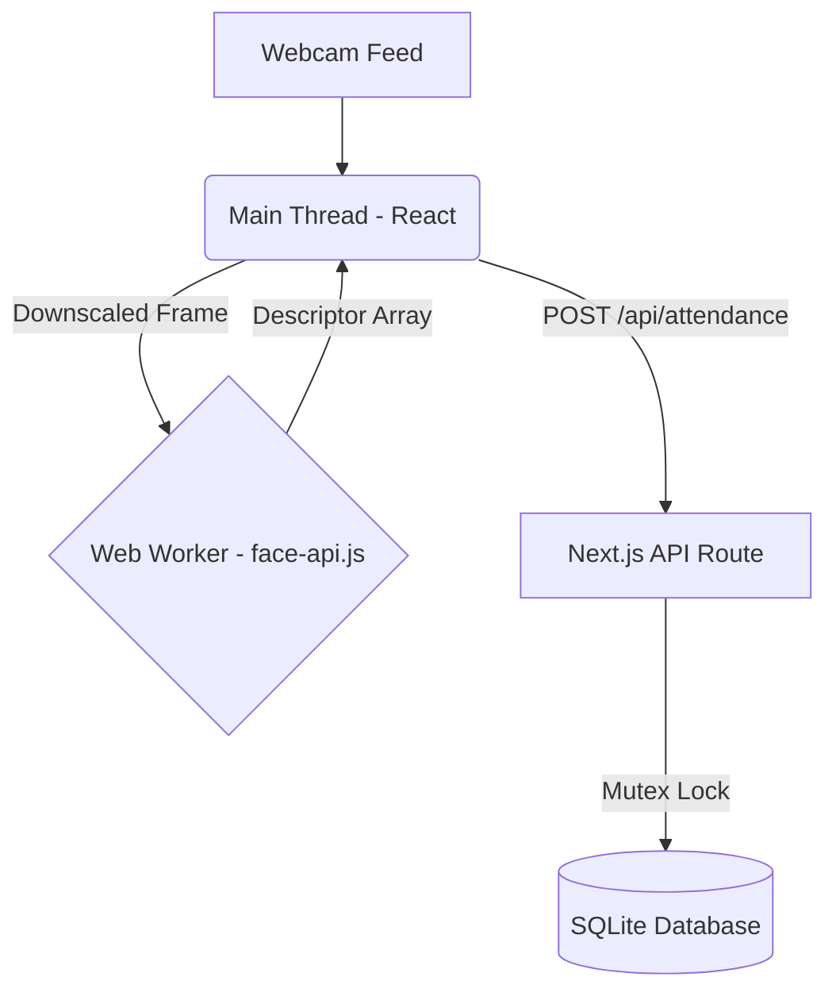

# System Architecture

## 1. High-Level Architecture
The AI Attendance System is a monolithic Next.js application that leverages React for the frontend, Node.js for the API layer, and an embedded SQLite database for edge storage.

## 2. Component Deep Dive

### 2.1 The Edge-AI Pipeline (Frontend)
Running facial recognition models (`face-api.js`) on the main JavaScript thread causes severe UI jitter, destroying the user experience.
- **Web Worker Offloading:** We isolate the inference engine in `workers/faceWorker.js`. The main thread captures the webcam at 60fps, resizes the frame to a maximum dimension of 320px for performance, and passes it to the worker. The worker returns a 128-dimensional Float32Array descriptor.
- **State Machine:** The React UI (`pages/index.js`) is strictly governed by a state machine (`SCANNING_QR` $\rightarrow$ `SCANNING_FACE` $\rightarrow$ `PROCESSING` $\rightarrow$ `SUCCESS`), ensuring users cannot bypass the required authentication sequence.

### 2.2 Backend Mutex & Race Condition Prevention
A standard TOCTOU (Time of Check to Time of Use) vulnerability exists if a user holds their face in front of the camera and the system triggers two rapid API requests before the database transaction concludes.
- **Solution:** An in-memory Map (`activeLocks`) tracks currently processing users. If `activeLocks.has(userId)` is true, the server responds with HTTP 409 (Conflict). The lock is exclusively released in the `finally` block of the API route.

### 2.3 Persistence Architecture
By default, Docker containers are stateless. 
- **SQLite Volume:** We utilize a host-mounted volume `./data:/app/data` to permanently map the embedded SQLite database (`attendance.db`) out of the container lifecycle.
- **Environment Agnosticism:** The application resolves the database path dynamically via `process.env.DB_PATH`.

### 2.4 Security & Admin Access
The system contains an administrative dashboard (`/admin`) for user registration.
- **Edge Middleware:** Access to the admin panel and its associated APIs (`/api/users`) is protected by HTTP Basic Authentication running on Next.js Edge Middleware. This intercepts unauthorized requests before they ever hit the React rendering engine or Node.js backend. Credentials are dynamically injected via environment variables (`ADMIN_USER`, `ADMIN_PASS`) at runtime via Docker Compose.
